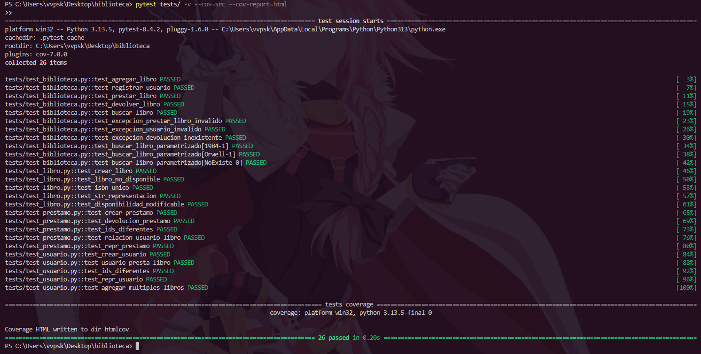

# Sistema de Gestión de Biblioteca (con Pruebas Unitarias)

## Descripción
Este proyecto implementa un sistema básico de gestión de biblioteca utilizando Python.  
Incluye clases para manejar **libros**, **usuarios**, **préstamos** y una **biblioteca**, además de una suite de **pruebas automatizadas** con `pytest` y reportes de cobertura de código.

---

## Estructura del proyecto
biblioteca/
│
├── src/
│ ├── init.py
│ ├── libro.py
│ ├── usuario.py
│ ├── prestamo.py
│ └── biblioteca.py
│
├── tests/
│ ├── init.py
│ ├── test_libro.py
│ ├── test_usuario.py
│ ├── test_prestamo.py
│ ├── test_biblioteca.py
│ ├── test_integracion.py
│ └── test_parametrizados.py
│
└── README.md

---

## Instalación

1. Instalar **Python 3.8+** desde [python.org/downloads](https://python.org/downloads/)
2. Instalar dependencias:
   ```bash
   pip install pytest pytest-cov


## Ejecución de pruebas

Ejecutar todas las pruebas con reporte de cobertura: pytest tests/ -v --cov=src --cov-report=html

El reporte se genera en: "htmlcov/index.html"

Abrir ese archivo en el navegador para ver los resultados de cobertura.

---

## Ejemplo de ejecución

Ejecutar en consola de comandos: pytest tests/ -v --cov=src --cov-report=html

Salida esperada:

==================== test session starts ====================
collected 25 items

tests/test_libro.py ..........
tests/test_usuario.py ..........
tests/test_prestamo.py ..........
tests/test_biblioteca.py ..........
tests/test_integracion.py ..
tests/test_parametrizados.py ..

---------- coverage: platform linux, python 3.10 ----------
Coverage HTML written to dir htmlcov

================= XX passed in XX s ========================

## Resultados

